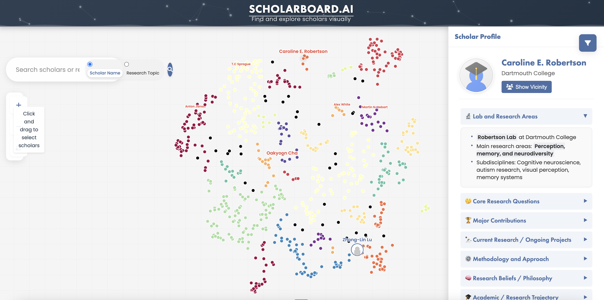

# ScholarBoard.ai



## What's the point of this repository?

ScholarBoard.ai is a Perplexity-powered tool that creates intuitive dashboards of researchers in specific fields (like vision neuroscience). It semantically arranges researchers based on their research similarity, allowing users to:

- Explore researchers and their work at a glance
- See related researchers in their vicinity 
- Search for specific researchers
- Embed research questions into the 2D visualization space

This tool transforms dense academic information into a navigable visual landscape, making it easier to discover connections between researchers and identify experts in specific domains.

## Technical Details

The ScholarBoard.ai pipeline functions through several key stages:

1. **Researcher Information Extraction**: Researcher summaries are extracted using optimized Perplexity Sonar prompts, pulling comprehensive information about their research focus, publications, and contributions.

2. **Data Cleaning**: Gemini Flash cleans and structures this data into markdown format, ensuring consistency and readability.

3. **Embedding Generation**: Researcher embeddings are created using one of three approaches:
   - Conference abstracts
   - Complete researcher summaries
   - Subset of researcher profiles (focused on research areas)

4. **Embedding Models**: The system supports multiple embedding models:
   - Latest Gemini embeddings
   - OpenAI text embeddings
   - Sentence transformers from Hugging Face

5. **Dimensionality Reduction**: The high-dimensional embeddings are reduced to 2D using one of three methods:
   - PCA: Linear dimensionality reduction
   - t-SNE: Non-linear dimensionality reduction preserving local structure
   - UMAP: Non-linear dimensionality reduction preserving both local and global structure (performs best)

6. **Clustering**: DBSCAN clustering algorithm assigns researchers to 15-40 clusters, color-coding them accordingly for easy visual identification of research communities.

### Installation

```bash
# Install uv if you don't have it
curl -sSf https://astral.sh/uv/install.sh | bash

# Install the package
uv pip install -e .
```

### Configuration

Create a `.env` file with your API keys:

```
PERPLEXITY_API_KEY=your_perplexity_api_key_here
OPENAI_API_KEY=your_openai_api_key_here
GEMINI_API_KEY=your_gemini_api_key_here
```

### Input Format

Create `scholars.csv` with columns:
- `scholar_id`: Unique identifier for the scholar
- `scholar_name`: Name of the scholar
- `institution`: Scholar's institution
- `country`: Scholar's country

Example:
```csv
scholar_id,scholar_name,institution,country
001,Michael Bonner,Johns Hopkins University,USA
002,Leyla Isik,Johns Hopkins University,USA
003,Nancy Kanwisher,MIT,USA
```

### Running the Pipeline

```bash
# Activate virtual environment
source .venv/bin/activate

# Run the complete pipeline
python scripts/run_pipeline.py
```

### Visualization

Once processed, researchers are visualized in an interactive 2D map where:
- Distance represents research similarity
- Colors represent research clusters
- Hover tooltips show researcher details
- Search functionality enables finding specific researchers

To view the visualization:
```bash
cd website && python serve.py
```

The dashboard will open in your browser at http://localhost:8000 