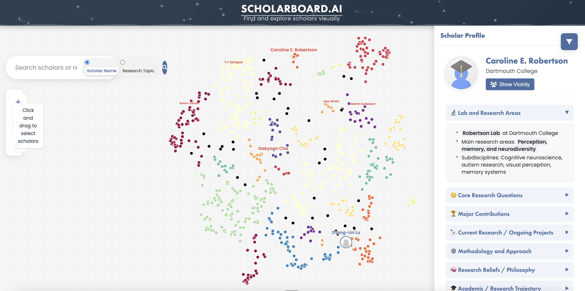

# ScholarBoard.ai



## What's the point of this repository?

ScholarBoard.ai creates interactive dashboards of researchers in specific fields (like vision neuroscience). It semantically arranges researchers based on their research similarity using Gemini grounded search for data extraction, OpenAI for embeddings, and UMAP/DBSCAN for clustering. Users can:

- Explore researchers and their work at a glance
- See related researchers in their vicinity
- Search for specific researchers
- Embed research questions into the 2D visualization space

This tool transforms dense academic information into a navigable visual landscape, making it easier to discover connections between researchers and identify experts in specific domains.

## Technical Details

The ScholarBoard.ai pipeline functions through several key stages:

1. **Researcher Information Extraction**: Researcher profiles and papers are extracted using Gemini 3 Flash Preview with Google Search grounding, pulling comprehensive information about their research focus, publications, and contributions.

2. **Data Cleaning**: Gemini Flash normalizes bios to ensure neutral tone and consistent formatting.

3. **Embedding Generation**: Researcher embeddings are created from paper abstracts using OpenAI text-embedding-3-large.

4. **Dimensionality Reduction**: UMAP reduces the high-dimensional embeddings to 2D, preserving both local and global structure.

5. **Clustering**: DBSCAN clustering algorithm assigns researchers to clusters, color-coding them for easy visual identification of research communities.

### Installation

```bash
# Install uv if you don't have it
curl -sSf https://astral.sh/uv/install.sh | bash

# Install the package
uv pip install -e .
```

### Configuration

Create a `.env` file with your API keys:

```
OPENAI_API_KEY=your_openai_api_key_here
GOOGLE_API_KEY=your_google_api_key_here
```

### Input Format

Create `scholars.csv` with columns:
- `scholar_id`: Unique identifier for the scholar
- `scholar_name`: Name of the scholar
- `institution`: Scholar's institution
- `country`: Scholar's country

Example:
```csv
scholar_id,scholar_name,institution,country
001,Michael Bonner,Johns Hopkins University,USA
002,Leyla Isik,Johns Hopkins University,USA
003,Nancy Kanwisher,MIT,USA
```

### Running the Pipeline

```bash
# Run the complete pipeline
.venv/bin/python3 scripts/run_pipeline.py --execute

# Show pipeline status
.venv/bin/python3 scripts/run_pipeline.py
```

### Visualization

Once processed, researchers are visualized in an interactive 2D map where:
- Distance represents research similarity
- Colors represent research clusters
- Hover tooltips show researcher details
- Search functionality enables finding specific researchers

To view the visualization:
```bash
cd website && .venv/bin/python3 -m http.server 8000
```

The dashboard will open in your browser at http://localhost:8000
