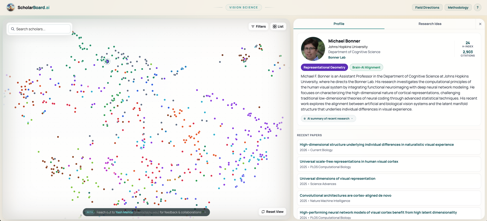

# 🧠 ScholarBoard.ai

**An interactive map of vision science — where every researcher is a dot, and nearby dots think alike.**

---

## What is this?

ScholarBoard.ai is a website that visualizes the field of vision science as a 2D map. Each dot is a researcher. Dots that are close together work on similar problems; dots that are far apart work on very different ones. The layout emerges entirely from AI — there are no manual labels or hand-curated clusters.

The current map covers **~730 vision science researchers** spanning the field's 23 subfields.

---

## What can you do on it?

- **Explore the map** — pan and zoom to see how the field is organized; clusters naturally form around shared research themes
- **Click any researcher** — see their bio, recent papers, institutional affiliation, and subfield tags
- **Find neighbors** — discover who is working on the most similar problems
- **Read AI-generated ideas** — each researcher has a novel research direction proposed by AI, grounded in their actual publications
- **Search** — look up researchers by name or describe a topic to find where it lives on the map

---

## Where does the data come from?

All researcher data is collected and processed automatically by an AI pipeline:

1. **Papers** — Gemini searches the web for each researcher's recent publications
2. **Profiles** — Gemini fetches their bio, institution, department, and lab URL from public academic pages
3. **Map layout** — paper texts are embedded into high-dimensional vectors, then reduced to 2D with UMAP and clustered with HDBSCAN
4. **Subfield tags** — each researcher is matched to the closest of 23 vision science subfields using semantic similarity
5. **Research ideas** — Gemini 3.1 Pro (with extended thinking) reads a researcher's papers and proposes a novel next direction
6. **Photos** — headshots are sourced from public academic pages via image search

The pipeline is re-run periodically to keep the data fresh.

---

## The 23 subfields

> *Neural Coding · Representational Geometry · Brain-AI Alignment · Predictive Dynamics · Object Recognition · Face Perception · Scene Perception · Active Vision · Visuomotor Action · Attention · Visual Working Memory · Ensemble Statistics · Perceptual Learning · Multisensory Integration · Perceptual Decision-Making · Visual Development · Neural Decoding · Comparative Vision · Motion Perception · Color Vision · Visual Search · Reading & Word Recognition · Mid-Level Features*

---

## License

MIT
