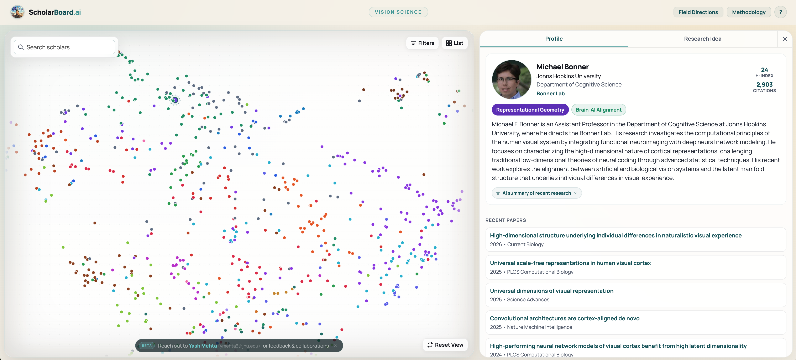

# 🧠 ScholarBoard.ai

**An interactive map of vision science — where every researcher is a dot, and nearby dots think alike.**

---

## What is this?

ScholarBoard.ai is a website that visualizes the field of vision science as a 2D map. Each dot is a researcher. Dots that are close together work on similar problems; dots that are far apart work on very different ones. The layout emerges entirely from AI — there are no manual labels or hand-curated clusters.

The current map covers **~810 vision science researchers** (principal investigators) spanning the field's 23 subfields.

---

## What can you do on it?

- **Explore the map** — pan and zoom to see how the field is organized; clusters naturally form around shared research themes
- **Click any researcher** — see their bio, recent papers, institutional affiliation, and subfield tags
- **Find neighbors** — discover who is working on the most similar problems
- **Search** — look up researchers by name or describe a topic to find where it lives on the map

---

## Where does the data come from?

All researcher data is collected and processed automatically by an AI pipeline:

1. **Papers** — Gemini 3.8 Flash searches the web for each researcher's recent papers (January 2023 onward, as first or last author; published versions preferred, preprints allowed, conference abstracts excluded)
2. **Profiles** — Gemini fetches their bio, institution, department, and lab URL from public academic pages
3. **Map layout** — each researcher's distilled research direction plus their paper texts are embedded into high-dimensional vectors, then reduced to 2D with UMAP to position them by research similarity
4. **Subfield tags** — a Gemini 3.8 Flash classifier reads each researcher's profile and assigns them to one of the 21 Vision Sciences Society (VSS) topic areas (one primary + up to two secondary)
5. **Photos** — headshots are sourced from public academic pages via image search

The pipeline is re-run periodically to keep the data fresh.

---

## The 21 subfields (VSS topic areas)

> *3D Perception · Perception & Action · Attention · Binocular Vision · Color, Light & Materials · Decision Making · Development · Eye Movements · Face & Body Perception · Motion · Multisensory Processing · Object Recognition · Perceptual Learning & Plasticity · Perceptual Organization · Scene Perception · Social Perception · Spatial Vision · Temporal Processing · Theory & Computation · Visual Memory · Visual Search*

---

## License

MIT
